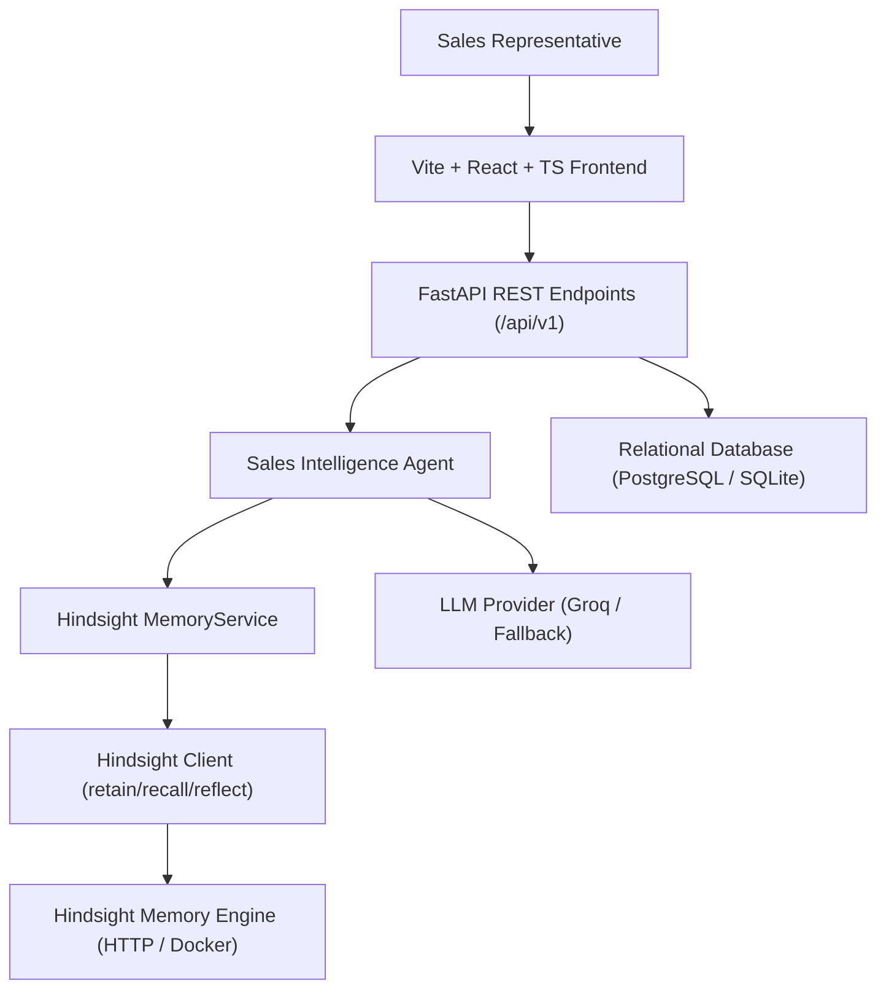

# DealMind Architecture Documentation

## 1. System Overview

DealMind is a memory-powered AI sales intelligence agent built specifically for enterprise sales representatives. Unlike traditional CRM chatbots that operate statelessly on a per-prompt basis, DealMind utilizes **Hindsight** as its persistent cognitive memory core.

## 2. Core Architecture Principle

> **"The LLM reasons. Hindsight remembers. PostgreSQL stores application state. The agent orchestrates."**

- **PostgreSQL / Relational DB**: Stores mutable application records: Users, Companies, Contacts, Deals, Tasks, and raw Interaction logs.
- **Hindsight Memory Layer**: Stores distilled, structured cognitive assets across multiple conversation sessions:
  - `CUSTOMER_PROFILE`: Organizational facts, tech stack, scale.
  - `BUDGET`: Explicit commercial parameters (e.g., ₹10 Lakh envelope).
  - `OBJECTION`: Historical friction points (e.g., CRM latency, SOC2 compliance).
  - `PREFERENCE`: Communication habits (e.g., live sandbox demos over slide decks).
  - `COMPETITOR`: Active competitive evaluations (e.g., Salesforce Einstein, HubSpot).
  - `COMMITMENT`: Promised action items and deliverables.
- **Sales Intelligence Agent**: Invokes targeted TEMPR memory recall before generating meeting briefs, objection radars, follow-up emails, or deal health assessments.

## 3. Technology Stack

- **Frontend**: React 19, TypeScript, Vite, Tailwind CSS, Lucide Icons, TanStack Query, Recharts.
- **Backend**: Python 3.12, FastAPI, Pydantic v2, SQLAlchemy 2.0 (asyncio).
- **AI Engine**: Groq API (`openai/gpt-oss-120b`, `qwen/qwen3-32b`) with provider abstraction.
- **Memory**: Hindsight Memory Engine.
- **Database**: PostgreSQL (with asynchronous SQLite dev support).
